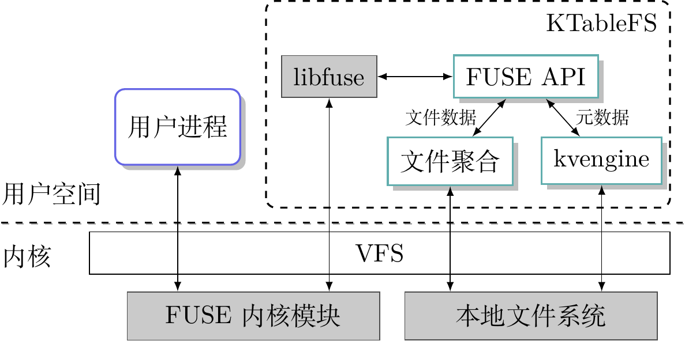
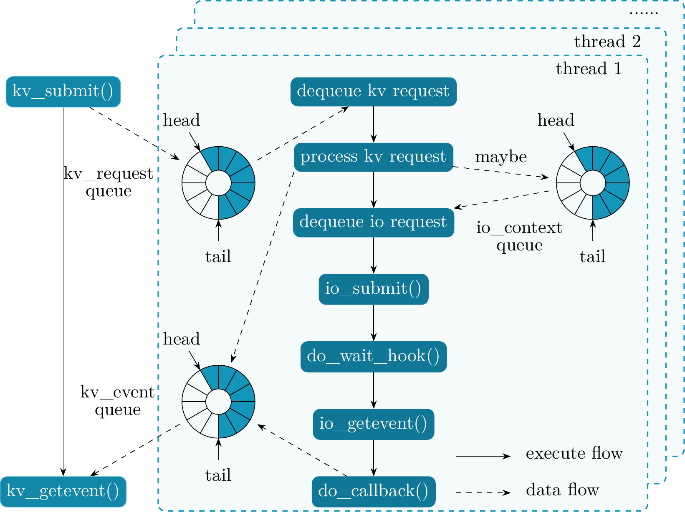
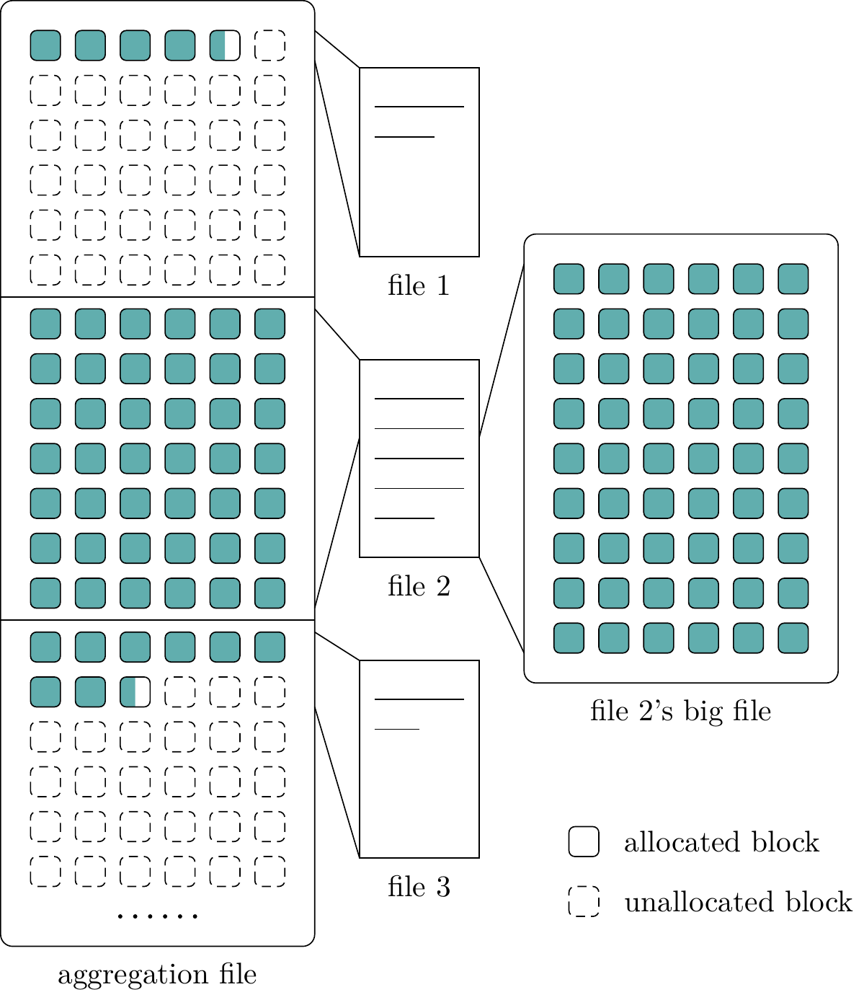

# KTableFS

KVell + TableFS

## trick

### nop()

```C
static inline void nop() {
  // volatile variable won't be optimized
  for (volatile int i = 0; i < 1000; ++i) ;
}
```

### struct definition

Be careful to define struct when it will be stored on disk or will
have much structure used in memory. Struct member's order maybe change
struct's size, because compiler maybe add some paddings to make it aligned.
Normally define struct members in size decreasing order will be good.

[The Lost Art of Structure Packing](http://www.catb.org/esr/structure-packing/)

## structure

### KTableFS structure



### kvengine



### file aggregation



https://stackoverflow.com/a/10997489/7640227
